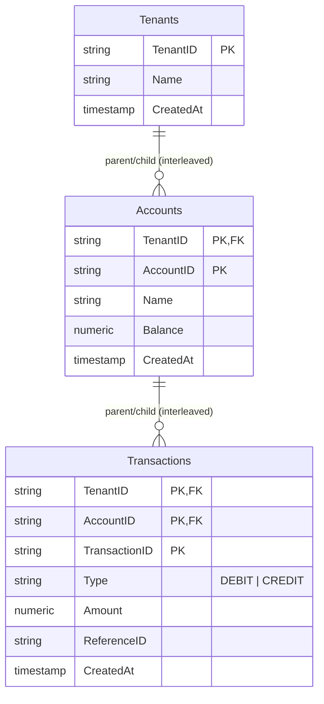

# Cloud Spanner Learning Project: SaaS Ledger

This file serves as the project's living memory, roadmap, and design blueprint.

We are building **SaaS Ledger**, a multi-tenant double-entry ledger system. It simulates a fintech platform where corporate clients (`Tenants`) manage digital wallets (`Accounts`) and execute financial transfers (`Transactions`). 

---

## 🏗️ System Design & Schema

### The Spanner Way: Hierarchical Interleaving
Spanner allows you to define parent-child relationships between tables. This co-locates child rows on the same physical server (split) as the parent row, optimizing joins and transaction latency.

Our schema uses a double-interleaved hierarchy:
1. `Tenants` (Parent)
2. `Accounts` (Child, interleaved under `Tenants`)
3. `Transactions` (Grandchild, interleaved under `Accounts`)



### Why This Design Fits Cloud Spanner:
1. **Primary Keys & Hotspots**: We will use UUIDv4 for `TenantID`, `AccountID`, and `TransactionID`. Sequential IDs or timestamp-prefixed keys would cause all writes to hit a single Spanner split (a hotspot), destroying scalability.
2. **Physical Co-location**: All accounts and transactions for a specific tenant are physically stored together. Reading a tenant's full transaction history requires no network hops across multiple database splits.
3. **Composite Primary Keys**: Interleaved tables require child tables to include the parent's primary keys as a prefix (e.g. `Accounts` PK is `(TenantID, AccountID)`).

---

## ⚙️ Spanner Emulator Setup Guide

To run the emulator locally, start it via Docker:
```bash
docker run -d -p 9010:9010 -p 9020:9020 gcr.io/cloud-spanner-emulator/emulator
```

Export the host variable (add this to your shell profile or run it before running your app):
```bash
export SPANNER_EMULATOR_HOST="localhost:9010"
```

Initialize your emulator instance and database:
```bash
# 1. Create a local gcloud configuration profile
gcloud config configurations create emulator
gcloud config set auth/disable_credentials true
gcloud config set project test-project
gcloud config set api_endpoint_overrides/spanner http://localhost:9020/

# 2. Create the instance
gcloud spanner instances create test-instance \
    --config=emulator-config \
    --description="Local Dev Instance" \
    --nodes=1

# 3. Create the database
gcloud spanner databases create ledger-db --instance=test-instance
```

---

## 🧪 Modern Go Toolchain, Testing, & Automation

To align with modern canonical Go standards, we configure formatting, linting, vulnerability analysis, testing, and continuous integration.

### Recommended Toolchain
1. **Go 1.22+**: Utilizing modern standard library enhancements and structured routing (if building APIs).
2. **`golangci-lint`**: The industry-standard aggregator for linters (replaces individual linters like `errcheck` and `staticcheck`). Configure it via a local `.golangci.yml`.
3. **`govulncheck`**: Go's official vulnerability detection tool that scans your codebase and its dependencies for known vulnerabilities.
4. **`gofmt` & `goimports`**: Built-in formatting and automatic import management.

### 1. Automation via a Makefile
We incorporate code formatting, linting, vulnerability checks, building, and running tests against the emulator:

```makefile
.PHONY: emulator-start emulator-stop emulator-init fmt lint vuln build test

# Run Spanner emulator container in background
emulator-start:
	docker run -d --name spanner-emulator -p 9010:9010 -p 9020:9020 gcr.io/cloud-spanner-emulator/emulator

# Stop Spanner emulator container
emulator-stop:
	docker stop spanner-emulator && docker rm spanner-emulator

# Initialize the emulator instance and database
emulator-init:
	gcloud config set api_endpoint_overrides/spanner http://localhost:9020/
	gcloud spanner instances create test-instance --config=emulator-config --description="Local Dev Instance" --nodes=1
	gcloud spanner databases create ledger-db --instance=test-instance

# Format code and imports
fmt:
	go run golang.org/x/tools/cmd/goimports -w .
	go fmt ./...

# Run standard linter aggregation
lint:
	golangci-lint run

# Scan for vulnerabilities in dependencies and code
vuln:
	go run golang.org/x/vuln/cmd/govulncheck ./...

# Build the application binary
build:
	go build -o bin/ledger cmd/ledger/main.go

# Run integration tests targeting the emulator
test:
	SPANNER_EMULATOR_HOST="localhost:9010" go test -v -race ./...
```

### 2. Integration Testing in Go (Isolated Databases)
Inside integration tests, use Spanner's Instance Administration client API to programmatically create and drop a fresh database for each run (e.g. `test-db-12345`). This guarantees clean, hermetic tests that can run concurrently.

### 3. CI/CD Integration: GitHub Actions
Automate your lint, vulnerability check, compile, and integration tests on push/pull requests:

```yaml
name: Go & Spanner Integration Pipeline

on: [push, pull_request]

jobs:
  lint-and-vuln:
    name: Code Quality & Security
    runs-on: ubuntu-latest
    steps:
      - name: Checkout Code
        uses: actions/checkout@v4

      - name: Set up Go
        uses: actions/setup-go@v5
        with:
          go-version: '1.22'

      - name: Run golangci-lint
        uses: golangci/golangci-lint-action@v6
        with:
          version: latest

      - name: Install govulncheck
        run: go install golang.org/x/vuln/cmd/govulncheck@latest

      - name: Run govulncheck
        run: govulncheck ./...

  integration-test:
    name: Integration Tests
    runs-on: ubuntu-latest
    
    services:
      spanner-emulator:
        image: gcr.io/cloud-spanner-emulator/emulator:latest
        ports:
          - 9010:9010
          - 9020:9020

    steps:
      - name: Checkout Code
        uses: actions/checkout@v4

      - name: Set up Go
        uses: actions/setup-go@v5
        with:
          go-version: '1.22'

      - name: Run Integration Tests
        env:
          SPANNER_EMULATOR_HOST: localhost:9010
        run: go test -v -race ./...
```

---

## 🗺️ Weekend Learning Roadmap

### 📦 Module 1: Connection & Ping
* **Goal**: Initialize your Go module, set up dependencies, connect to the Spanner Emulator, and run a sanity check query.
* **Key Concepts**: [spanner.NewClient](https://pkg.go.dev/cloud.google.com/go/spanner#NewClient), client lifecycle, session pool, and running basic queries.
* **Your Task**:
  1. Initialize `go.mod`.
  2. Write `main.go` to connect to `projects/test-project/instances/test-instance/databases/ledger-db`.
  3. Execute `SELECT 1;` and print the result.

### 📐 Module 2: Schema Migration & DDL
* **Goal**: Apply the hierarchical table schema to the database.
* **Key Concepts**: Data Definition Language (DDL) in Spanner, interleaved tables, and `NUMERIC` data types (crucial for financial decimals).
* **Your Task**:
  1. Write the DDL schema statement utilizing `INTERLEAVE IN PARENT` and `ON DELETE CASCADE`.
  2. Apply the DDL schema to your local database using `gcloud spanner databases ddl update` or the Go client administration API.

### ✍️ Module 3: Mutations & Account Creation
* **Goal**: Learn how to insert data efficiently.
* **Key Concepts**: [spanner.Mutation](https://pkg.go.dev/cloud.google.com/go/spanner#Mutation) (buffered writes), `spanner.InsertOrUpdate`, and performance characteristics of mutations.
* **Your Task**:
  1. Implement a Go function to provision a new Tenant with a set of default Accounts (e.g. `Checking` and `Savings`) using `spanner.Apply`.
  2. Implement a simple key-based look up function to fetch and print an account balance using [spanner.Client.ReadRow](https://pkg.go.dev/cloud.google.com/go/spanner#Client.ReadRow).

### 🔄 Module 4: Read-Write Transactions & Money Transfers
* **Goal**: Perform atomic debit/credit operations across accounts.
* **Key Concepts**: Read-Write Transactions, automatic transaction aborts & retries, and data consistency.
* **Why it matters**: In Spanner, transactions can abort due to locks/conflicts. The Go SDK handles retries automatically by executing your transaction function multiple times until it succeeds.
* **Your Task**:
  1. Implement a `TransferFunds` function.
  2. It must read the balances of the source and destination accounts inside a transaction, verify funds, update balances, and insert ledger `Transactions` records.

### 🔍 Module 5: Read-Only Transactions & Audits
* **Goal**: Generate consistent reports across accounts without locking the database.
* **Key Concepts**: Read-Only Transactions, strong reads vs. stale reads (timestamp bounds), lock-free read scalability.
* **Your Task**:
  1. Implement a Go function that generates a consolidated audit balance report across all accounts for a tenant.
  2. Use a Read-Only Transaction to guarantee a point-in-time snapshot.

### ⚡ Module 6: Secondary Indexes & Performance
* **Goal**: Retrieve transactions by non-primary keys efficiently.
* **Key Concepts**: Secondary Indexes, storing columns (`STORING` clause), and query execution plans.
* **Your Task**:
  1. Write a query to fetch all transaction entries matching a custom `ReferenceID`.
  2. Observe that searching without an index performs a full table scan.
  3. Apply a DDL update to create a secondary index on `ReferenceID` with `STORING (Amount, Type)` to prevent back-joins.

---

## 📈 Progress Tracker

| Module | Topic | Status | Notes |
| :--- | :--- | :--- | :--- |
| **1** | Connection & Ping | ✅ Completed | Successfully initialized module and verified client connection |
| **2** | Schema Migration & DDL | ✅ Completed | Successfully defined and applied interleaved table hierarchy |
| **3** | Mutations & Account Creation | ✅ Completed | Implemented model generation using 'yo' and verified basic CRUD writes/reads |
| **4** | Read-Write Transactions | ✅ Completed | Implemented atomic double-entry balance transfer with audit log mutations |
| **5** | Read-Only Transactions | ⏳ Not Started | |
| **6** | Indexes & Query Optimization | ⏳ Not Started | |
