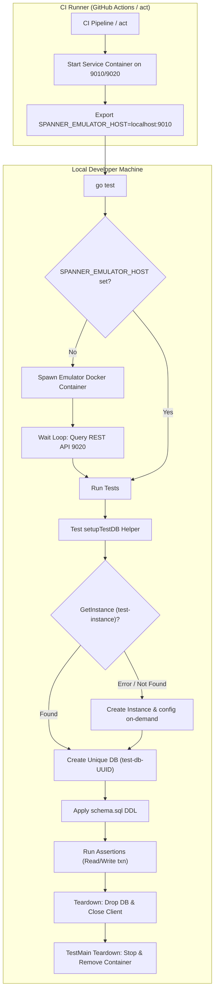

# Google Cloud Spanner: Hermetic Testing Reference Project

This repository serves as a reference implementation demonstrating **best practices for hermetic and isolated integration testing of Google Cloud Spanner** in Go applications. It showcases how to write plug-and-play, parallelizable integration tests utilizing the local Spanner Emulator and standard CI pipelines.

---

## Table of Contents
1. [Architecture Overview](#1-architecture-overview)
2. [Hermetic Test Scaffolding](#2-hermetic-test-scaffolding)
   - [Automated Emulator Lifecycle](#automated-emulator-lifecycle)
   - [Database Isolation per Test](#database-isolation-per-test)
   - [Dynamic DDL Schema Migration](#dynamic-ddl-schema-migration)
3. [Workload Simulation](#3-workload-simulation)
4. [Model Generation (yo)](#4-model-generation-yo)
5. [Build & Testing Automation](#5-build--testing-automation)
   - [Makefile Orchestration](#makefile-orchestration)
   - [CI/CD Pipeline (GitHub Actions & act)](#cicd-pipeline-github-actions--act)
6. [Prerequisites](#6-prerequisites)

---

## 1. Architecture Overview

To achieve true hermetic testing, the test suite is entirely self-contained. It programmatically manages the lifecycle of its dependencies and isolates state at the database level.



---

## 2. Hermetic Test Scaffolding

The core testing patterns are implemented in [main_test.go](./main_test.go).

### Automated Emulator Lifecycle
* **Dynamic Hook**: The `TestMain` function orchestrates the lifecycle. If `SPANNER_EMULATOR_HOST` is not set, it programmatically starts the Spanner Emulator container locally.
* **REST Health Check**: A retry loop queries the emulator's REST administrative port (`9020`) to verify the emulator is online and fully responsive before executing the tests.
* **Dynamic Instance Provisioning**: In `setupTestDB`, the harness uses `instanceAdminClient.GetInstance` to check if `test-instance` exists. If it is not found, the harness dynamically registers the instance configuration and spins up the instance on-demand.
* **Deferred Cleanup**: Once test execution finishes, a shutdown handler stops and removes the container, leaving the host system in its original state.

### Database Isolation per Test
* **Bounded UUID Naming**: Every integration test case invokes a setup helper that creates a uniquely named database using a random UUID suffix. The database ID is explicitly sliced (`[:30]`) to conform to Spanner's 30-character database name limitation.
* **Context Lifecycle Management**: All Spanner client calls and admin requests utilize `t.Context()` (introduced in Go 1.24). This binds the query and transaction execution contexts directly to the test lifecycle, automatically aborting operations if the test times out or is cancelled.
* **Concurrency Safety**: By avoiding a shared database instance, tests run under complete isolation, preventing cross-test data pollution or transaction lock contention.
* **Hermetic Teardown**: The setup helper returns a cleanup function that drops the temporary database via the Database Admin API and closes the clients.

### Dynamic DDL Schema Migration
* **Semicolon Parsing**: During database initialization, the test suite reads [schema.sql](./schema.sql) and splits the DDL by semicolons.
* **Sanitization**: It automatically filters out empty statement blocks (e.g. caused by trailing semicolons) to prevent database driver errors.
* **Online Creation**: The clean statements are passed as `ExtraStatements` to the `CreateDatabase` call to build the schema online.

---

## 3. Workload Simulation

The database schema under test is a multi-tenant double-entry financial ledger (**SaaS Ledger**):
* **Hierarchy**: Uses interleaved tables (`Tenants` -> `Accounts` -> `Transactions`) to showcase physical co-location optimizations.
* **Relational integrity**: Utilizes `ON DELETE CASCADE` to verify transaction safety during deletions.
* **Secondary Indexing**: Utilizes index-only scans via the `TransactionsByReferenceID` index.

These relational patterns are tested under strict transactions in [main.go](./main.go) to demonstrate correct error recovery, transaction retries, and stale snapshot reads.

---

## 4. Model Generation (yo)

Go struct models and Spanner database queries are automatically generated from [schema.sql](./schema.sql) using the [yo code generator](https://github.com/cloudspannerecosystem/yo) tool (specifically tailored for Cloud Spanner).

### Code Generation Workflow
* **Automatic Mapping**: The `yo` generator parses standard Spanner DDL files, maps Spanner types (such as `NUMERIC`, `TIMESTAMP`, and `STRING`) to Go native types (such as `big.Rat`, `time.Time`, and `string`), and writes clean database abstraction logic to the `models/` directory.
* **Helper Script**: To regenerate the database models after making changes to [schema.sql](./schema.sql), run the utility script:
  ```bash
  ./scripts/generate_models.sh
  ```
  Internally, this wrapper invokes:
  ```bash
  yo generate schema.sql --from-ddl -o models
  ```
* **Index-based Query Generation**: Any unique or secondary index declared in [schema.sql](./schema.sql) (such as `TransactionsByReferenceID`) triggers `yo` to generate type-safe finder methods. For example, it automatically generates `FindTransactionsByAmountTransactionTypeReferenceID` inside the models module to query the database using that specific index.

---

## 5. Build & Testing Automation

### Makefile Orchestration
The local task runner is defined in the [Makefile](./Makefile):
* `fmt`: Formats source files and arranges imports using `goimports`.
* `lint`: Runs aggressive code checks via `golangci-lint`.
* `build`: Compiles the Ledger application binary.
* `test`: Runs the integration test suite with data race detection enabled (`-race`).
* `vuln`: Performs binary vulnerability scanning using `govulncheck`.

### CI/CD Pipeline (GitHub Actions & act)
The continuous integration pipeline is defined in [.github/workflows/ci.yaml](./.github/workflows/ci.yaml):
* **Service Container**: Spins up a Spanner Emulator container sidecar mapped to ports `9010` and `9020` of the runner network.
* **Linter Step**: Runs `golangci-lint-action` to parse and output errors directly to the pull request interface.
* **Makefile Execution**: Exports `SPANNER_EMULATOR_HOST: localhost:9010` so that `TestMain` bypasses local Docker management and executes assertions against the runner service container.
* **Local act Workaround**: Passes `--workdir /` to the service container options to resolve the `WorkingDir` directory-shadowing bug when simulating the workflow locally on a development machine.

---

## 6. Prerequisites

* Go v1.26.4
* Docker Desktop (with Rosetta 2 enabled if running on Apple Silicon Macs)
* `golangci-lint` (for local styling checks)
* `act` (optional, for simulating CI workflows locally)
* `yo` (Spanner code generator CLI tool, installed via `go install github.com/cloudspannerecosystem/yo@latest`)
